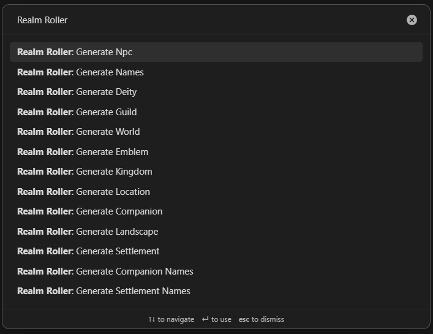
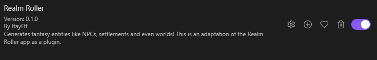
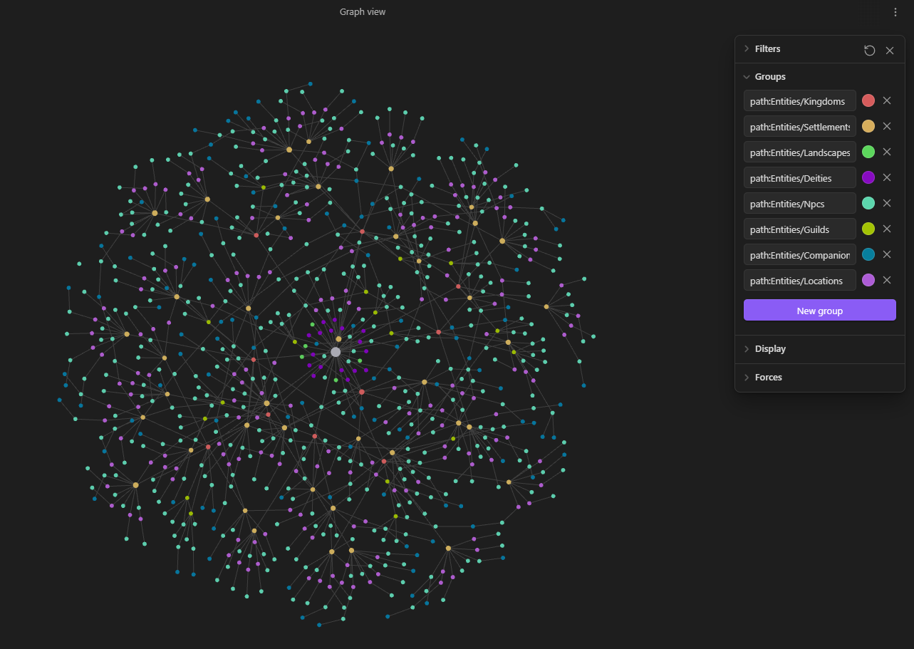
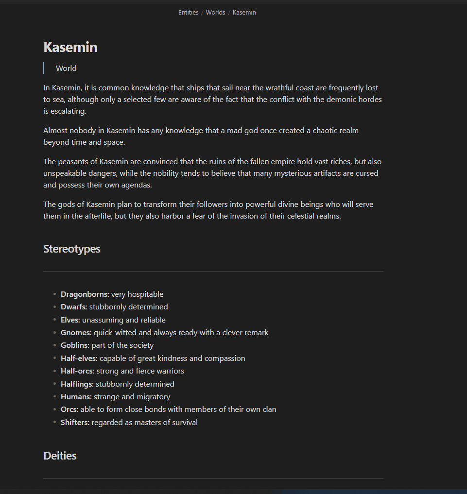
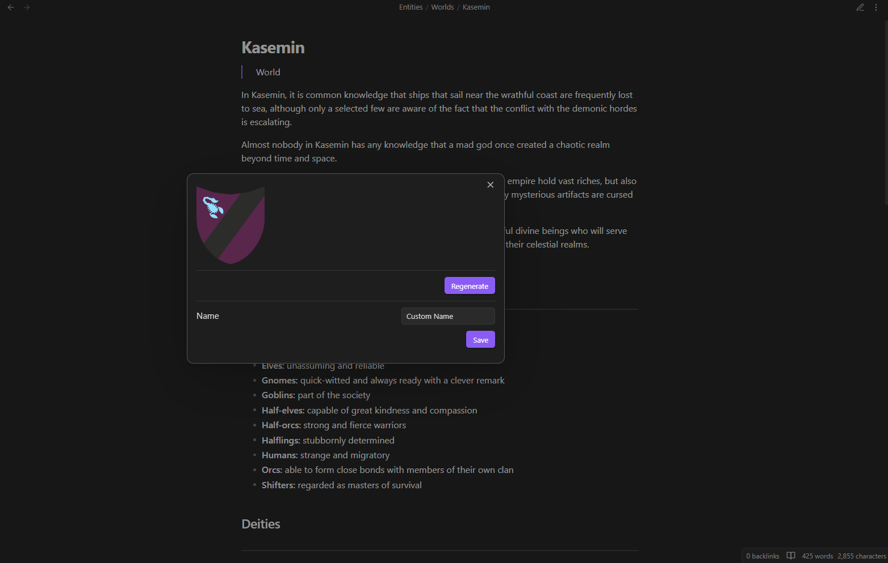

# Realm Roller

This is an adaptation of the android app [Realm Roller](https://play.google.com/store/apps/details?id=com.itaybenhaim.realm_roller) as an obsidian plugin.

It allows generating fantasy entities all within your vault!

## Features

**Note: This plugin is currently in alpha version**

This obsidian plugin is perfect for generating any type of entities needed for a fantasy game!
The plugin allows you to select one of the commands (See image). and it generates the appropriate entity with all its other prerequisites with a single click of a button.
For example, generating a settlement also generates some locations in the settlement, and for each location an NPC as an owner, and maybe even a companion if the owner happens to have one.

As you can tell, this plugin is capable of generating a whole depth world within a fraction of a second, so go give it a try!

The entities are stored in a root folder which can be selected from the plugin settings (default is `Entities`).

## Installation and Setup

1. Open your vault's `.obsidian` folder and create a folder named `plugins` inside it.
2. Create another folder named `obsidian-realm-roller` inside the `plugins` folder.
3. Copy the `main.js` and `manifest.json` files from the repo to the folder.
4. Open obsidian, go to Settings -> Community Plugins and enable them
5. After enabling the community plugins, you should see the plugin in the list of you plugins. Enable it:

6. Click the gear icon next to the plugin and change the root folder [optional]
7. Click `ctrl+p` or the `Open command palette` icon in the left bar and type `"Realm Roller"`. You will see all the options you have for generating entities. It doesn't matter what file you have open, the command will open the newly generated one.
8. Modify the generated entity as you like

## Technical Information

This plugin is an adaptation of the android app [Realm Roller](https://play.google.com/store/apps/details?id=com.itaybenhaim.realm_roller). The app has almost the same features regards to generating entities, so feel free to check it too if you want another tool at your disposal.

Both this plugin and the app use the [randpg](https://github.com/ItayElf/randpg/tree/main) dart package for generating the entities. This plugin uses a version of the package compiled to JavaScript.

## Screenshots

_This is a graph view of a single generated world (approximately 850 entities!)_

_Emblem generator_

